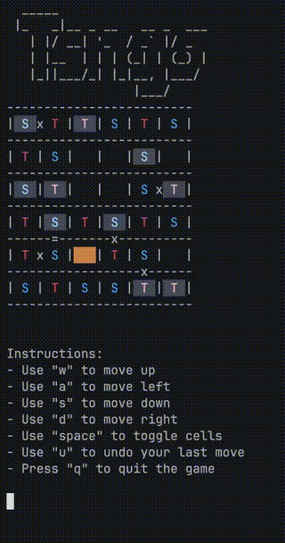

# Tsngo - LinkedIn's Tango replica

Tsngo (TS + Tango, pronounced as "_tee-san-go_") is a replica of [Tango](https://www.linkedin.com/games/tango/) (a puzzle game created by LinkedIn) in TypeScript.



## Running the demo

If you just want to play the game, I have already implemented a working example as a CLI for you to have some fun with it. Simply do the following:

- Clone the repository and visit the directory:
  `git clone https://github.com/travistang/tsngo && cd tsngo`

- Install the dependencies:
  `npm install`
- Run:
  `npx ts-node examples/tsngo-cli/index.ts`

I assume you know how to play the original game. If you don't please check out LinkedIn's tutorial!

## Using it in your own project

- Install it with npm (or any of your favourite package manager):
  `npm install tsngo`
- Then use it in your code like:

```
import Tsngo from 'tsngo';

// Create a new game instance
const game = new Tsngo();

// Initialize the game
game.initialize();

// Select a cell
game.select(2, 3);

// Undo the last move
game.undo();

// Check if the board is valid
console.log(game.isValid());

// is the puzzle solved?
game.solved(); // false

// Reset the game
game.reset();
```
